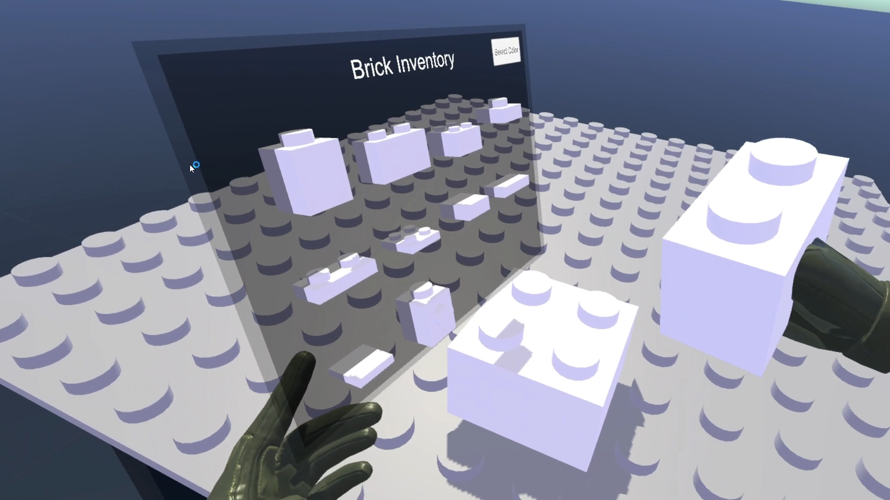
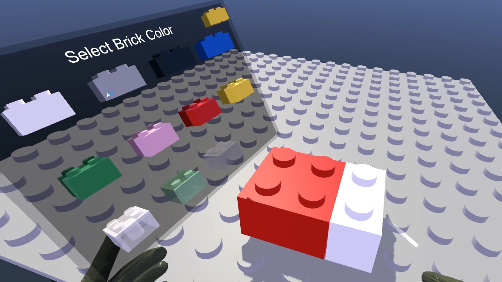
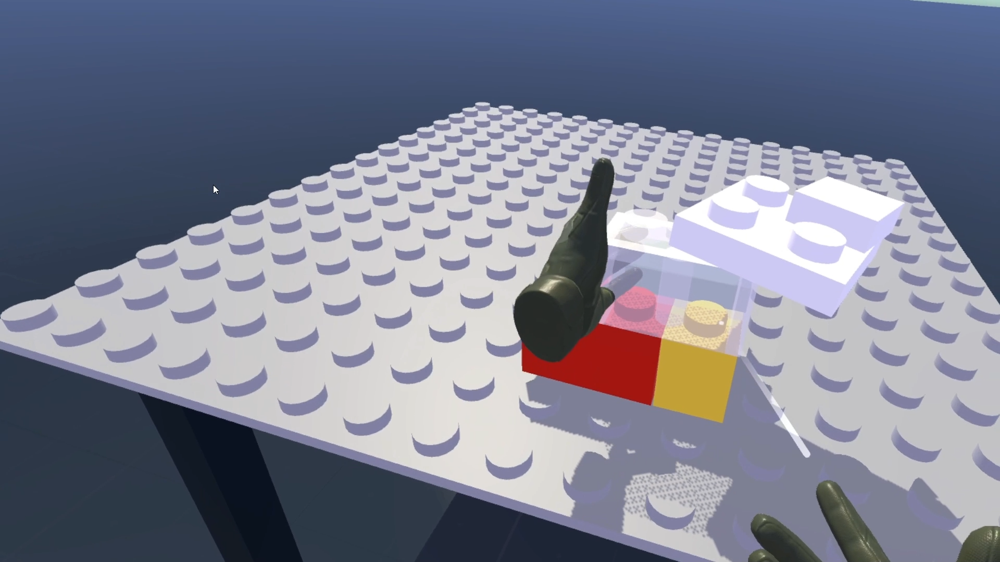
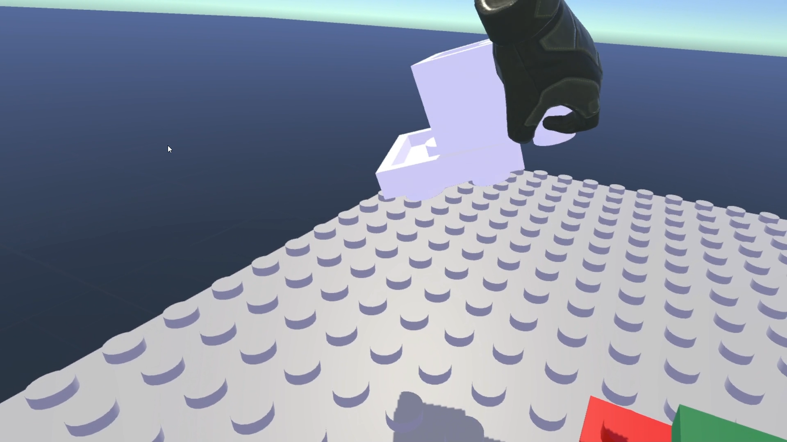

# LegoVR
Lego building in virtual reality - First VR project using Unity - ESIEE Paris E4FI

https://youtu.be/mRjhS7ncvAs

# Instruction de l'application

## Objectif

L'objectif de l'application est de permettre aux utilisateurs de construire ce qu'ils veulent avec des Lego en réalité virtuelle.

## ACV

### Observation

* Fonctionnalité 1 : Voir les briques et autres objets présents dans la scène, visualiser ses mains en jeu (immersion proprioceptive)
* Fonctionnalité 2 : Voir les différents types et couleurs de briques via des menus

### Manipulation

* Fonctionnalité 3 : La manipulation tridimensionnelle et l'orientation spatiale d'un Lego (6dll) pour pouvoir l'intégrer à une construction
* Fonctionnalité 4 : Attraper une brique, l'imbriquer ou la désimbriquer des autres briques
* Fonctionnalité 5 : La couleur de la brique est choisie à partir d’un clic dans le menu des couleurs et peut s'appliquer à une brique existante de la scène via un viseur

### Déplacement

* Fonctionnalité 6 : Déplacement autour ou à travers de la table pour réaliser sa construction

## Les contrôles

* Déplacement : Joystick gauche (appuyer pour la téléportation)
* Rotation de la vue : Joystick droit
* Attraper une brique : Grip (3 doigts inférieurs de la main)
* Désimbriquer : Trigger (index) de la main tenant la brique
* Inventaire des briques : X (gauche)
* Menu des couleurs : Y (gauche)
* Interagir avec les couleurs : Trigger (index) de la main droite avec le pointeur laser
* Quitter : Menu (gauche)

# Remarques

## Limitations

La connexion entre les briques est réalisée à partir d'un joint Unity. C'est pratique et ça fonctionne plutôt bien, mais en forçant trop sur les briques il est possible de réaliser des actions normalement impossibles.

Une tentative de modification de ce système a été réalisée, cependant par manque de temps et de disponibilité vis-à-vis du matériel de RV, elle n'a pas été concluante. Le principe était de gérer la connexion à travers une relation de parenté dans Unity, et symboliser les liaisons à l'aide d'un graphe. Bien que peu robuste (si l'utilisateur arrivait à former un cycle dans le graphe, une boucle infinie aurait été créée), ce système fonctionnait. Le problème a été pour la désactivation des différents composants de la brique (il aurait sans doute fallu désactiver le RigidBody, ou du moins le rendre kinematic, et probablement remplacer le Grabbable par un GrabbableInChildren (ayant une référence vers le Grabbable de la brique racine de la construction) pour pouvoir attraper toute la construction, mais cela aurait introduit d'autre problématiques (détection de la brique à séparer lors de la désimbrication, et notre composant LegoBrick requiert Grabbable (car il hérite de GrabbableEvents) donc il aurait fallu l'adapter également).

## Bugs connus

Comme l'action de re-coloration et celle de désimbrication d'un Lego partagent le contrôle "Trigger" (pour la main droite), lorsqu'on essaye de désimbriquer un Lego avec notre main droite, on va aussi le re-colorer par la même occasion, ce qui n'est pas souhaité. Il faudrait désactiver cette action lorsqu'on tient une brique, ou même changer un des deux contrôles (touche A ou B de la main droite pour la re-coloration par exemple, qui est une action secondaire) pour lever l'ambigüité.

## Voies d'amélioration

En plus de la correction des bugs et limitations évoquées précédemment, nous aimerions ajouter la possibilité de scroller dans l'inventaire des briques et le menu des couleurs pour ajouter une palette plus grande de possibilités. Une barre de recherche deviendrait peut-être également une nécessité (ou un système de catégories de briques classés par type), ainsi qu'une possibilité de sauvegarder des briques et couleurs en favori.

# Répartition des tâches dans le projet

* Jenny : Rédaction du document de conception, création de modèles de briques
* Chang : Rédaction du document de conception, intégration des sons des briques
* Théo : Développement du code
